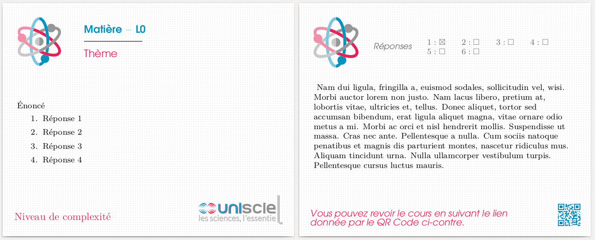
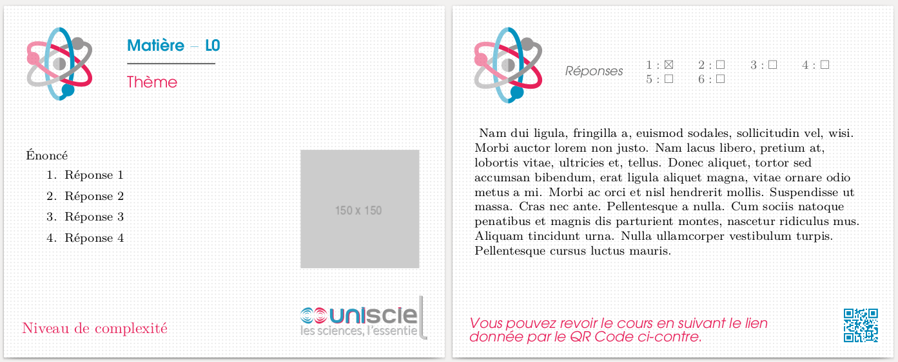
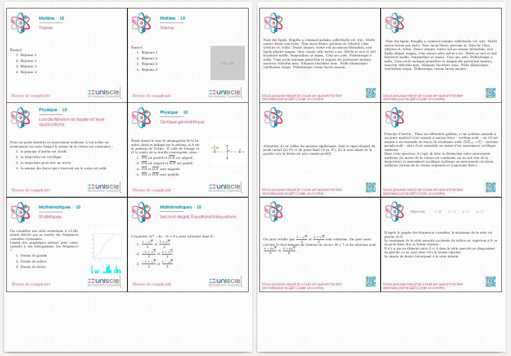

- [Introduction](#introduction)
  - [SCENARIchain and Opale](#scenarichain-and-opale)
    - [What is SCENARIchain ?](#what-is-scenarichain-)
    - [What is Opale?](#what-is-opale)
    - [Documentation](#documentation)
  - [Why this script?](#why-this-script)
- [Project's roadmap](#projects-roadmap)
  - [To do list](#to-do-list)
- [Getting Started](#getting-started)
  - [Prerequisites](#prerequisites)
    - [Linux systems](#linux-systems)
    - [Windows](#windows)
    - [macOS](#macos)
  - [Installing and first test run](#installing-and-first-test-run)
- [How to use the script?](#how-to-use-the-script)
  - [General instructions](#general-instructions)
- [Definition of a flashcard and associated XML tags](#definition-of-a-flashcard-and-associated-xml-tags)
    - [Metadata](#metadata)
      - [Subject and the subject's theme.](#subject-and-the-subjects-theme)
      - [Complexity level](#complexity-level)
      - [Education level](#education-level)
    - [Content](#content)
      - [Question](#question)
      - [Choices](#choices)
      - [Solutions](#solutions)
      - [Answer (explanations)](#answer-explanations)
  - [Customisable design elements](#customisable-design-elements)
    - [Filigrane](#filigrane)
    - [Subject's icon and university's logo](#subjects-icon-and-universitys-logo)
    - [Back footer text and QR Code](#back-footer-text-and-qr-code)
- [LaTeX](#latex)
  - [General Latex implementation of a flashcard](#general-latex-implementation-of-a-flashcard)
  - [Graphic charter](#graphic-charter)
  - [Default output format (10x8cm)](#default-output-format-10x8cm)
    - [Output properties, card's size and margins](#output-properties-cards-size-and-margins)
    - [Standard flashcard template](#standard-flashcard-template)
    - [Flashcard with image template](#flashcard-with-image-template)
    - [Solutions boxes](#solutions-boxes)
    - [Explanations](#explanations)
  - [a4paper output format](#a4paper-output-format)
    - [Output properties, card's size and margins](#output-properties-cards-size-and-margins-1)
    - [Other changes](#other-changes)
- [Script (Python)](#script-python)
  - [Generalities](#generalities)
  - [Flashcards validation check](#flashcards-validation-check)
  - [Output settings](#output-settings)
  - [Rich content](#rich-content)
  - [Debugging tools](#debugging-tools)
  - [Running the tests](#running-the-tests)
- [Contributing](#contributing)
- [Author](#author)
- [License](#license)
- [Acknowledgments](#acknowledgments)
# Converting Opale XML to LaTeX flashcards <!-- omit in toc -->
## Introduction
>**If you are already familiar with the Scenari software suite, you can skip the following introduction.**

This project is backed by [*Unisciel*](http://www.unisciel.fr/), an online university creating and providing resources for secondary school pupils aged 15-18 (*lycée*), students, teachers and educational institutions.
### SCENARIchain and Opale
#### What is SCENARIchain ?
SCENARIchain refers to all Scenari software that involve structured collaborative writing.

For individual use, SCENARIchain can be deployed as a desktop application.
For collaborative use, SCENARIchain can be deployed as a server. 

#### What is Opale?
Opale is a publishing chain part of the [Scenari](https://scenari.org/co/home.html) software suite. It is used to produce resources for academic training. These documents can be used for on-site, distance or blended learning. 

Opale can be used to:
- Design training modules, blending learning and evaluations activities into a single storyline.
- Produce from a single content multiple documents:
  - (web) Online course material,
  - (PDF) Printable booklet for learners
  - (HTML) Slideshows
  - (PDF) Training document
- Add rich multimedia content to the course: videos, sounds, images, diagrams, mathematical formulas (LaTeX, OpenDocument)
- Create [quizzes][quizz]: multiple choice question (MCQ), multi choice question single answer, [categorise items][categorise], [order items][order], etc.
- Create accessible training materials in web format (HTML)
- Export content compatible with [SCORM][SCORM] (SCORM 1.2, or SCORM2004) standard to distribute them either via a Learning Management System (LMS), or a MOOC platform. Please refer to the [official website](https://scorm.com/) for more details.

[SCORM]: https://trac.scenari.org/opale/wiki/scorm
[quizz]: https://moodle.utc.fr/file.php/1330/cometes-modules/cometes-module-3-advanced/cometes-module-3-parcours/co/0551_exercices_interactifs.html
[categorise]: https://moodle.utc.fr/file.php/1330/cometes-modules/cometes-module-3-advanced/cometes-module-3-parcours/co/0551a_categorisation.html
[order]: https://moodle.utc.fr/file.php/1330/cometes-modules/cometes-module-3-advanced/cometes-module-3-parcours/co/guide_advanced.html

You will find below some examples of content produced using the Opale module in different format.

From left to right: web material, web slideshow, PDF OpenDocument, web publication using [Emeraude](https://download.scenari.software/Emeraude@1.3.0.07/). 

[](https://example.scenari.software/Opale@3.8/auroraW)
[ ](https://example.scenari.software/Opale@3.8/auroraD)
[](https://example.scenari.software/Opale@3.8/paperLight)
[](https://example.scenari.software/Opale@3.8/auroraAW)


#### Documentation
[SCENARIchain documentation (English)](https://doc.scenari.software/SCENARIchain@5.0/en/)

[SCENARIchain documentation (French)](https://doc.scenari.software/SCENARIchain@5.0/fr/)

[Opale documentation (English)](https://doc.scenari.software/Opale@3.8/en/)

[Opale documentation (French)](https://doc.scenari.software/Opale@3.8/fr/)
### Why this script?
The aim of this script is to produce printable flashcards to be used as learning support material for undergraduate students mainly. The format used is 10x8cm. You can find an example file [here](./LaTeX/flashcard_1x1.pdf).

It can also be used to produce printable flashcards at home for students' personal use. (A4 paper format). Please refer to the example [file](./LaTeX/flashcard_2x3.pdf) given in the LaTeX folder for more details.

Find below the front and the back of a flashcard. 

**Please note that the examples are models that were produced at the beginning of the project as a first design of the flashcard and are OUTDATED. Some additional changes have been made since, including adding correct answers checkboxes on the back of the flashcard. Some other changes may or may not be made in the future.**


## Project's roadmap
- The script is a POC, therefore some functionalities may not work perfectly. Please use the debugging tools to check the validity of the produced flashcards before printing or sending into production.
### To do list
- Short tasks
  - A short text and a QR code are added automatically at the back of the flashcard. Add an option to disable it.
  - Add option to disable choice explanation's output. 
- Moderately long tasks
  - Image suppport is limited, as it's always put on the right side of the text. Better image support.
  - The icon is included in all flashcards. Implement a system to handle different icons according to which subject the flashcard has.
  - As of now, only one document is given "out.pdf" as the script's output. Categorised output will be added (sorted by subject, errors flashcards, etc.).
  - Template LaTeX flashcards' better
    - Transfer a4paper positions to Python, to prepare for an eventual move to a configuration file.
    - Create a new command for solutions boxes.
- Long tasks
  - The QR code is static, a dynamic QR code generation according to the ressources found in the source file may be added in the future.
  - Write a configuration file template (YAML?) to implement:
    - custom short text on the back of the flashcard
    - custom subject/licence_theme dictionary and complexity_level dictionary 
    - QR Code toggle
    - etc.
    - Expected behaviour:
      - Set default values to the script console options 
      - console options should override configuration file
## Getting Started
The root folder contains:
- [LICENSE](LICENSE), the license file.
- [README.md](README.md), this file.

There are three folders in this repository : Example files, LaTeX and Python. 

* The LaTeX folder is a playground for templating flashcards using the script. It contains basic examples and the models used for creating flashcards.
* The Python folder contains the script, two headers for two distinct ouput format and one footer. It also has some basic icons.
* The Example files folder contains `themeLicence.xml`, `9047.quiz`, and `8983.quiz` and folders leading to the image resource used by `9047.quiz`. 

### Prerequisites
The script has only been tested on a linux system so far (Ubuntu 18.04.4 LTS). If all dependencies are installed, it should probably work seamlessly. You might need to tweak a few settings for `inkscape` to work properly.

Here is the latexmk recipe I use in VS Code's LaTeX Workshop:
```json
"name": "latexmk",
"command": "latexmk",
"args": [
    "-xelatex",
    "-synctex=1",
    "-interaction=nonstopmode",
    "-file-line-error",
    "-outdir=%OUTDIR%",
    "--shell-escape",
    "-cd",
    "%DOC%"
]
```

#### Linux systems
Install `python3` if needed and `inkscape` ([Installation guide](https://wiki.inkscape.org/wiki/index.php/Installing_Inkscape#Installing_on_Linux)), these are required packages.

The following packages are optional : `latexmk` ([Installation guide](https://mg.readthedocs.io/latexmk.html))(necessary to use the `--compile` option). As perl is installed by default, there is no need to install it. 
You may need to update your packages

#### Windows
Install `python3` ([Installation guide](https://docs.python.org/3/using/windows.html)) and `inkscape` ([Installation guide](https://wiki.inkscape.org/wiki/index.php/Installing_Inkscape#Installing_on_a_Windows_system)).

Optional : You can install `latexmk` through MikTex on Windows. If MikTex is not already installed, please follow this [link](https://miktex.org/download). `latemxk` needs Perl, you can install [Strawberry Perl](http://strawberryperl.com/).

#### macOS
MacOS comes with Python 2.7 pre-installed. Since this script has been tested on Python 3, please update your version of Python if it's already not up-to-date. You can find an installation guide here : [MacPython](https://docs.python.org/3/using/mac.html).

Inkscape is used to include `.svg` files. Here is an installation guide, and a faq : [installation guide and faq](https://wiki.inkscape.org/wiki/index.php/Installing_Inkscape#Installing_on_a_Mac).

Optional : `latexmk` is probably already installed. If not, follow instructions [here](https://miktex.org/howto/install-miktex-mac).

### Installing and first test run

Clone the repository where you want it to be and set it as your current working directory.

```
git clone https://gitlab.utc.fr/quachpas/cap_flashcards/
cd  ./cap_flashcards
```
At this point, if you want to run the script, you need source files. There is a sample provided in the folder [Example files](/Example-files/).

Open a terminal and run the script.
> For now, you need an XML files with all themes. There is one provided in the repository for example's sake. Please adjust as necessary. 

```
python3 ./Python/opale2flashcard.py ./Examples-files ./Examples-files/themeLicence.xml
```

The output will be in `./cap_flashcards/Python/output/out.tex`.
## How to use the script?
### General instructions
The script works in collaboration with SCENARIchain.
You will need the following:
- Source files: the sources files **must be mcqSur or mcqMur quizzes** XML files, which you can download from your SCENARIchain server using the export option or export from your SCENARIchain desktop app. Find more details in the [Getting started](#getting-started) section.
- Licence theme file: as seen above, the flashcards each have a **subject** and a **theme**. As these are stored in the form of a code (#subj-them) in the source file, we need to produce a dictionary with all valid associations. This dictionary can be hard-coded in the script in the `opale_to_tex` function.
- Media resources: 
  - Compulsory resources are the subject logo (upper left) and university's logo (bottom right on the front). 
    > Both of these **must be** SVG files.
  - an icon and a logo are provided by default in [Python/output/images](./Python/output/images). 
> The script uses some tags that are present in Opale's document models **mcqSur** and **mcqMur**. Please find Opale's documentation [here](https://download.scenari.software/Opale@3.7/).

## Definition of a flashcard and associated XML tags
The following XML tags are associated with Opale's model document (`mcqSur`, `mcqMur`).
We consider the following elements for a flashcard:
#### Metadata
##### Subject and the subject's theme.
 The tags are `sp:themeLicence` or `sp:themeLycee` tags. This script is destined for students, so we're only using the first one. 
> Both subject and the subject's theme depend on the themes file given as an argument to the script. One example is provided in [`/cap_flashcards/Example-files`](Example-files/themeLicence.xml).
##### Complexity level
The complexity ranges from 1 to 4, and corresponds to a custom dictionary following Unisciel's standards.
The complexity level correspond to `sp:level`.
> I will try to make it customisable in the future. 
##### Education level
The education level corresponds to `sp:educationLevel`. The script simply outputs the tag content.

Here is a sample code deliberately left in its original formatting:
```xml
<op:mcqMur xmlns:op="utc.fr:ics/opale3" xmlns:sp="http://www.utc.fr/ics/scenari/v3/primitive">
		<op:exeM>
			<sp:themeLycee>#chim-obscoulim-matcolo-forlewis-</sp:themeLycee>
			<sp:themeLicence>#chim-strucmat-</sp:themeLicence>
			<sp:level>1</sp:level>
			<sp:educationLevel>L0</sp:educationLevel>
			<sp:info>
				<op:info>
					<sp:cpyrgt>
						<op:sPara>
							<sc:para xml:space="preserve">
							
      <sc:phrase role="url">
<op:urlM>
<sp:url>http://unice.fr</sp:url>
</op:urlM>unice.fr</sc:phrase>
    						
						</sc:para>
						</op:sPara>
					</sp:cpyrgt>
				</op:info>
			</sp:info>
		</op:exeM>
```
#### Content
As we are converting MCQ into flashcards, the content is defined by the question and the choices on the front, the solutions and the answer (or explanation) on the back.

##### Question
The question is enclosed in `sc:question` tags. Here is a first code sample :
```xml 
<sc:question>
			<op:res>
				<sp:txt>
					<op:txt>
						<sc:para xml:space="preserve">
			Comment appelle-t-on la représentation bidimensionnelle des atomes/molécules où l'on symbolise les électrons célibataires, les charges et les doublets non liants ?
		</sc:para>
					</op:txt>
				</sp:txt>
			</op:res>
		</sc:question>
```
As you can see, some questions are fairly simple and text represents the whole content. However, that is generally not the case :
```xml
<sc:question>
			<op:res>
				<sp:txt>
					<op:txt>
						<sc:para xml:space="preserve">
			Parmi les propositions suivantes, quelle est l'électrode siège de l'oxydation dans la pile Daniell ?
		</sc:para>
					</op:txt>
				</sp:txt>
				<sp:res sc:refUri="&amp;/Questions/Chimie/POSchim/images/image20.png">
					<op:resInfoM/>
				</sp:res>
				<sp:txt>
					<op:txt>
						<sc:para xml:space="preserve">Lors de l'expérience, on observe la réduction du cuivre :
		</sc:para>
						<sc:para xml:space="preserve">
			Cu<sc:textLeaf role="exp">2+</sc:textLeaf> + 2 eˉ → Cu
		</sc:para>
						<sc:para xml:space="preserve">
			et l'oxydation du zinc :
		</sc:para>
						<sc:para xml:space="preserve">
			Zn → Zn<sc:textLeaf role="exp">2+</sc:textLeaf> + 2eˉ.</sc:para>
					</op:txt>
				</sp:txt>
			</op:res>
		</sc:question>
```
Here, the question is made up of three parts : a text section, an image resource and another text section, respectively denoted by `sp:txt` and `sp:res`.

Some content might be enclosed in special tags inside a paragraph. For example `sc:textLeaf`, which result will differ based on the value of its attribute `role`. Here, an `exp` role will result in enclosing the tag's content with `$^{}$`.
##### Choices
The choices are inside a `sc:choices` tags, and each choice, including its explanation if there exists one, is enclosed inside a `sc:choice` tag. The choice's content is enclosed inside `sc:choiceLabel` and its explanation inside `sc:choiceExplanation`.
We have the following structure :
```xml
<sc:choices>
    <!-- First choice -->
    <sc:choice>
        <sc:choiceLabel>
        <!-- CHOICE 1-->
        </sc:choiceLabel>
        <sc:choiceExplanation>
        <!-- CHOICE 1 EXPLANATION-->
        </sc:choiceExplanation>
    </sc:choice>
    <!-- Second choice -->
    <sc:choice>
        <sc:choiceLabel>
        <!-- CHOICE 2-->
        </sc:choiceLabel>
    </sc:choice>
</sc:choices>
```
##### Solutions
For `mcqSur` files, where only a single answer is accepted, a `sc:solution` tag will follow immediately after the choices. For example :
```xml
<sc:solution choice="1"/>
```
For `mcqMur` files, the solutions are given as attributes of the choices.
```xml
<sc:choice solution="unchecked">
<sc:choice solution="checked">
```

##### Answer (explanations)
There are two types of explanations : global explanations (`sc:globalExplanation`) and choice explanations (`sc:choiceExplanation`).
The first one comes after `sc:choices`, and is basically another section.
The second one comes after `sc:choiceLabel` inside a `sc:choice`. 
For example :
```xml
<sc:choice solution="unchecked">
    <sc:choiceLabel>
      <op:txt>
        <sc:para xml:space="preserve">
  La réaction est réalisée dans les proportions stœchiométriques.
</sc:para>
      </op:txt>
    </sc:choiceLabel>
    <sc:choiceExplanation>
      <op:txt>
        <sc:para xml:space="preserve">
  La réaction n'est pas réalisée dans les proportions stœchiométriques car les rapports <sc:textLeaf role="mathtex">n_i(\textrm{H}_2(g))/2</sc:textLeaf> et <sc:textLeaf role="mathtex">n_i(\textrm{O}_2(g))/1</sc:textLeaf> sont différents,<sc:textLeaf role="mathtex">n_i</sc:textLeaf>
  désignant la quantité de matière initiale du réactif.</sc:para>
      </op:txt>
    </sc:choiceExplanation>
  </sc:choice>
```
### Customisable design elements
Some elements were added on the flashcard for esthetism' sake or practical reasons.
All these elements were added to the flashcard using `tikzpicture` to a fixed position to prevent the flashcard's content from displacing them. 

#### Filigrane
A filigrane was added to both front and back of the flashcard, otherwise the flashcard content on the other side might become readable depending on the paper used. 
It is implemented directly in LaTeX using a customisable `pgf` pattern (stars and dots) and `tikzpicture`. 

> There is no easy way to modify the patterns right now, you have to modify the header files directly to change the patterns.

#### Subject's icon and university's logo
The subject's icon is placed on the upper left side of the flashcard, on both front and back. It is included in the `.tex` file from an `.svg` file and using `inkscape` to convert it to a `.pdf_tex` file. 

The university's logo on the lower right side of the front is produced identically to the subject's icon. 

To customise these logos, you only need to provide another file. You may need to change the files' names according to your needs:
- The university's logo includes by default `university_logo.svg`.
- The subjects' icons include `[lowercase.subject].svg` by default. If the flashcard's subject is "Mathématiques", then it will try to include `mathématiques.svg`.
#### Back footer text and QR Code
The text and the QR code are placed manually using `tikzpicture`. 
> As of now, there is no simple way to customise the these. You have to modify the header file directly. The text is placed manually using absolute positionning. 

## LaTeX

### General Latex implementation of a flashcard
> You will find below an exhaustive explanation of the header files, so the reader can modify it afterwards if needed. In the following paragraphs, we will assume the reader has sufficient knowledge of LaTeX.

We use the [`flashcards` class](https://ctan.org/pkg/flashcards) for both output format. Follow the link to the class' CTAN page, and its documentation if you want to know more about the class itself. 

Options used:
- The default option used is `avery5371`. 
- The `frame` option is used to reveal the flashcard's edge. This option is enabled in the a4paper output format. It reveals where to separate the flashcards after printing them.
- Add the `grid` option to reveal the **flashcard's content borders**. As specified in the class' documentation, there will be a uniform margin between the frame and the edge, defined by the length `\cardmargin`.

### Graphic charter
- Three colors are used that are part of unisciel's graphic charter
    ```latex
    \definecolor{uniscielblue}{RGB}{4,146,191}
    \definecolor{uniscielpink}{RGB}{231,33,90}
    \definecolor{uniscielgrey}{RGB}{103,104,104}
    % Bleu : #0492bf
    % Rose : #e7215a
    % Gris : #676868
    ```
- We use the package `fontspec` to set custom fonts:
    ```latex
    \usepackage{fontspec}
    %ITC Avant Garde Gothic 
    \setsansfont{ITC Avant Garde Gothic}[
        UprightFont={* Book},
        ItalicFont={* Book Oblique},
        BoldFont = {* Demi},
        BoldItalicFont = {* Demi Oblique}
    ]
    ```   
- The class' commands `\cardfrontstyle` and `\cardbackstyle` are used to set the content's font size and alignement behaviour.
    ```latex
    % --- FONT SIZE --- %
    \cardfrontstyle[\footnotesize\raggedright]{headings}
    \cardbackstyle[\footnotesize\raggedright]{plain}
    ```


### Default output format (10x8cm)
The package `geometry` is used to define the output's format.
```latex
 \geometry{
    %showframe,
    papersize={10cm,8cm},
    marginparsep=0cm,
    footskip=0cm,
    hmargin=2mm,
    vmargin=2mm,
 }
```
#### Output properties, card's size and margins
We define the lengths of the class as such:
```latex
\def\pageheight{7.4cm}
\def\pagewidth{9.5cm}
\renewcommand{\cardpapermode}{portrait}
\renewcommand{\cardrows}{1}
\renewcommand{\cardcolumns}{1}
\setlength{\cardheight}{\pageheight}
\setlength{\cardwidth}{\pagewidth}
...
\setlength{\cardmargin}{3mm}
\setlength{\topoffset}{0mm}
\setlength{\oddoffset}{0mm}
\setlength{\evenoffset}{0mm}
```
We define some custom lengths used to position the content correctly:
```latex
\newlength{\questionvspace}
\setlength{\questionvspace}{-2\baselineskip}
\newlength{\answervspace}
\setlength{\answervspace}{0cm}
```
#### Standard flashcard template
The output template is as such :


The base of the flashcard template is written as such:
```latex
\cardfrontfooter{Complexity level}{subject}
\begin{flashcard}[\cardfrontheader{Subject}{Education Level}{Subject Theme}]{
%%%%%%%%%%%%%%% ÉNONCÉ %%%%%%%%%%%%%%%%
\vspace{\enoncevspace} % Text vertical positionning
[Insert Question here]
\begin{enumerate}
    \item Choice 1
    \item Choice 2
    \item Choice 3
    \item Choice 4
    \item Choice 5
    \item Choice 6
\end{enumerate}
}
%%%%%%%%%%%%%%% ÉNONCÉ %%%%%%%%%%%%%%%%
\vspace*{\stretch{1}}
%%%%%%%%%%%%%%% RÉPONSE %%%%%%%%%%%%%%%%
\vspace{\reponsevspace} % Text vertical positionning

% SOLUTIONS BOXES % 
% Tikz picture
% SOLUTIONS BOXES %

[Insert explanations here]
%%%%%%%%%%%%%%% RÉPONSE %%%%%%%%%%%%%%%%
\vspace*{\stretch{1}}
\end{flashcard}
```
#### Flashcard with image template
An example flashcard:

The template code can be written as:
```latex
\cardfrontfooter{Complexity level}{subject}
\begin{flashcard}[\cardfrontheader{Subject}{Education Level}{Subject Theme}]{
%%%%%%%%%%%%%%% ÉNONCÉ %%%%%%%%%%%%%%%%
\vspace{\enoncevspace} % Text vertical positionning
\begin{minipage}[t]{0.6\linewidth}
  [Insert Question here]
  \begin{enumerate}
      \item Choice 1
      \item Choice 2
      \item Choice 3
      \item Choice 4
      \item Choice 5
      \item Choice 6
  \end{enumerate}
\end{minipage}%
\hfill
\begin{minipage}[t]{0.3\linewidth}
    \strut\vspace*{-\baselineskip}\newline
    \includegraphics[max size={\textwidth}{0.5\textheight}, center, keepaspectratio]{[Insert path to image]}
\end{minipage}
}
...
\end{flashcard}
```
The image is added using `minipage`. We split the flashcard's front into two pieces. The image is placed on the right side. The script will add all images in the flashcard's question section. 
> As of now, every image will be placed on the right side regardless of its proportions. Eventually, I will try to implement a better image support.

#### Solutions boxes
The solutions boxes are drawn using `tikzpicture`. A row consists of four checkboxes. 
```latex
\begin{tikzpicture}[remember picture, overlay]
  \node [align=left, opacity=1] at ([xshift=-1.75cm, yshift=2.5cm]current page.center) {
      \color{uniscielgrey}
      \textsf{\textit{Answers}}
  };
  \node [align=left, opacity=1] at ([xshift=1.75cm, yshift=2.5cm]current page.center) {
      \color{uniscielgrey}
      $1:\boxtimes\qquad2:\square\qquad3:\square\qquad4:\square\qquad$\\
      \color{uniscielgrey}
      $5:\square\qquad6:\square\qquad$
  };
\end{tikzpicture}
```
> As of now, this code is repeated in every flashcard. The positions are written via the Python script.

#### Explanations
Choices explanations if they exist are written in an `enumerate` block. The global explanation is written afterwards as text. 
```latex
\cardfrontfooter{Complexity level}{subject}
\begin{flashcard}[\cardfrontheader{Subject}{Education Level}{Subject Theme}]{
%%%%%%%%%%%%%%% ÉNONCÉ %%%%%%%%%%%%%%%%
\vspace{\enoncevspace} % Text vertical positionning
% Question + Choices
}
\vspace*{\stretch{1}}
\vspace{\reponsevspace}
% Solutions Boxes

% Choices explanations
\begin{enumerate}
\item [i.] Choice explanation for choice n°i
\end{enumerate}
% Choices explanations

[Insert global explanation]

\vspace*{\stretch{1}}
\end{flashcard}
```

### a4paper output format
We set the output format using the `geometry` package:
```latex
\geometry{
  % showframe,
  a4paper,
  marginparsep=0cm,
  footskip=0cm,
  hmargin=2mm,
  vmargin=2mm,
}
```
#### Output properties, card's size and margins
The vertical positionning lengths for the question and the answer and the card margins are kept identical to the default output format. 

We change the lengths and parameters related to the card's size:
```latex
\newlength{\pageheight}
\newlength{\pagewidth}
\def\pageheight{297mm}
\def\pagewidth{210mm}
\renewcommand{\cardpapermode}{portrait}
\renewcommand{\cardrows}{3}
\renewcommand{\cardcolumns}{2}
\setlength{\cardheight}{8cm}
\setlength{\cardwidth}{10.2cm}
```
#### Other changes
1. The `\cardfrontfooter` command takes arguments for 6 flashcards at once. 
2. The command managing the fixed elements is scaled to print the elements for 6 flashcards. 



## Script (Python)

### Generalities 
- We use `lxml`'s `etree` `XMLparser` to scan through the contents of the source files. 
- A single `.tex` file is produced as the output. Hopefully, that will change in the future.

The steps the script goes through are the following:
1. Validity check for the arguments
2. Writing the dictionaries `licence_theme` and `subject`.
3. Write the header in `output.tex` 
4. For each `.quiz` file in the source directory:
   1. Fetch the flashcard's content and return it. That is, fetch all metadata, the question, the choices, the solutions, and the answer. 
   2. Perform both overflow and metadata check on the flashcard.
   3. If the `--force` option has been declared, replace the missing metadata by dummy text, to avoid LaTeX compilation errors.
   4. If the output format is the default:
      1. Create an output string from the flashcard only if it has no errors, except if `--force` has been declared.
      2. If the flashcard is valid, or if the `--force` option has been declared, write in the outfile the output created according to the various output options (`file_name`, `image_only`, `overflow_only`), if any have been used.
      > This part is most probably going to change to accomodate the multiple output files.
      3. Else, the flashcard isn't valid, and we process the errors.
      4. If the `--force` option has been used, but the flashcard's error message isn't empty, then we process the errors.
   5. Else, the output format is `a4paper`. We append every flashcard to a list. 
5. If the output format is `a4paper`:
   1. 
6. Write the footer in `output.tex`


### Flashcards validation check
The script will check the validity of the flashcards produced from the `.quiz` source files. 
Only `mcqSur` and `mcqMur` question types are completely supported.
For other types, the behaviour is unpredictable.  
1. Missing content:
    The script will continue if a flashcard has missing content,
    whether that be the question, choices, solutions or answer. 
    The script will give a warning message. 
2. Missing metadata:
    The script will NOT output the flashcard if it has missing metadata.
    You can bypass this behaviour using the `--force` option.
    Be aware that it replace missing metadata with `Missing  [METADATA_NAME]`. 
3. Content size:
    Some flashcards have large content, these might overflow,
    and will be removed from the output by default. 
    The criteria used to define that is a simple character count. 
    Q : Question, C : Choices, A : Answer
    Flashcards with an image in their question are flagged if :
        - Q + C > 700 or A > 950
    Flashcards without are flagged if :
        - Q + C > 800 or A > 950
4. Content check:
   1. If an answer contains an URL (http), then it's flagged. 

### Output settings
The script will write in the './output/out.tex' file. 
The front is always output before the back of the flashcard. 
There are two output formats : 
- default, the page's dimensions are 10x8 cm. 
- a4paper, the output's format is an A4 page.
Every page contains 6 flashcards (10x8 cm). A grid outlines the borders. This is the preferred format for printing flashcards at home.

Some options can be used to filter the output (image_only, overflow_only, file_name [file_name])
Combining these options will not join the results. The priority order is the following : `--file_name`, `--image_only`, `overflow_only`, `non_relevant_only`. 
Using these options can help greatly in checking whether a flashcard is correctly transcripted.

### Rich content
Some flashcards contents can be quite rich. 
Below, we define which content is supported or not.
1. Question:
    - TWO images maximum. We consider that fitting two images on one flashcard
    is possible, but that would notably reduce the size and therefore make
    them indistinct. Image file format supported are pdf, png, jpeg, eps.
    If the script finds any occurences of "ci-contre" (see below), it will replace 
    them by "ci-contre". Use '--no_replace' to remove this behaviour.
    - Tables are supported within reason. 
    - MathLaTeX is supported.
2. Choices:
    - MathLaTeX is supported.
3. Answer:
    - MathLaTeX is supported.
    - Links are supported. They are removed by default. 
    This behaviour can be removed using the 'add_url' option.

### Debugging tools
Some options are available to help debug the code and/or check if the output
is correct. 
Logs will be in './output/logs.txt'. 
### Running the tests

The `--debug_mode` option should be enabled if you want to check the pdf output. It will let you associate the output to the original file name.

Given the following console output : 
```
python3 opale2flashcard.py faq2sciences/Physique-optigeom_2020-2-14/\&
opale2flashcard.py(9583.quiz): Metadata is missing.
opale2flashcard.py(9593.quiz): Metadata is missing.
opale2flashcard.py(9568.quiz): Image - Potentially overflowing content (Q, C, A): 445 100 1642
opale2flashcard.py(9721.quiz): Metadata is missing.
opale2flashcard.py(9541.quiz): No image - Potentially overflowing content (Q, C, A): 246 581 733
opale2flashcard.py(9569.quiz): Metadata is missing.
opale2flashcard.py(9620.quiz): Metadata is missing.
opale2flashcard.py(9540.quiz): WARNING ! This flashcard has an issue. There is nothing on the back.
opale2flashcard.py(9548.quiz): No image - Potentially overflowing content (Q, C, A): 255 624 831
opale2flashcard.py(9523.quiz): No image - Potentially overflowing content (Q, C, A): 215 133 1468
opale2flashcard.py(9612.quiz): Metadata is missing.
opale2flashcard.py(9592.quiz): Metadata is missing.
opale2flashcard.py(9572.quiz): Metadata is missing.
opale2flashcard.py(9608.quiz): Metadata is missing.
opale2flashcard.py(9624.quiz): No image - Potentially overflowing content (Q, C, A): 232 282 1348
opale2flashcard.py(9624.quiz): Metadata is missing.
opale2flashcard.py(9574.quiz): Metadata is missing.
opale2flashcard.py(9573.quiz): Metadata is missing.
opale2flashcard.py(9582.quiz): WARNING ! This flashcard has an issue. There is nothing on the back.
opale2flashcard.py(9582.quiz): Metadata is missing.
opale2flashcard.py(9588.quiz): Metadata is missing.
opale2flashcard.py(9558.quiz): No image - Potentially overflowing content (Q, C, A): 120 184 1185
opale2flashcard.py(9590.quiz): Image - Potentially overflowing content (Q, C, A): 414 68 1407
opale2flashcard.py(9590.quiz): Metadata is missing.
opale2flashcard.py(9504.quiz): Metadata is missing.
opale2flashcard.py(9616.quiz): No image - Potentially overflowing content (Q, C, A): 290 214 1541
opale2flashcard.py(9616.quiz): Metadata is missing.
opale2flashcard.py(9605.quiz): Metadata is missing.
opale2flashcard.py(9602.quiz): Metadata is missing.
opale2flashcard.py(9597.quiz): No image - Potentially overflowing content (Q, C, A): 984 461 1558
opale2flashcard.py(9597.quiz): Metadata is missing.
opale2flashcard.py(9580.quiz): Metadata is missing.
opale2flashcard.py(9560.quiz): No image - Potentially overflowing content (Q, C, A): 122 197 1118
opale2flashcard.py(9581.quiz): Metadata is missing.
opale2flashcard.py(9586.quiz): Metadata is missing.
opale2flashcard.py(9579.quiz): Metadata is missing.
opale2flashcard.py(9587.quiz): Metadata is missing.
opale2flashcard.py(9599.quiz): Metadata is missing.
opale2flashcard.py: 32/66 flashcards have missing metadata errors.
 These files will not be transcripted. Use option "--force" to ignore.

WARNING : We replaced every occurence of "ci-dessous" in the question by "ci-contre". If it was a mistake, please modify as necessary.
 Use option --no_replace to deactivate this feature.
Please make use of the "--overflow-only" option to check every flashcard for potential defects
opale2flashcard.py: The .tex file out.tex has been created in ./output directory. Compiling it will produce a pdf file containing all flashcards in the specified source directory.
 Use option '--compile' if you want to compile directly after. You must have latexmk installed.

```

Several issues seem to arise:
1. Some flashcards have missing metadata. These are listed, if you want to know which metadata is missing exactly, you can use the `--verbose` option to get more details.
2. Some flashcards have potentially overflowing content. The console outputs the len of the question, choices and answer in this order.
It also says whether the flashcard has an image in its question or not. You can use the `--overflow_only` option to compile and see the pdf output.
Using the `--image_only` option is also useful to check whether the images are sufficiently distinct.
3. One warning is given : 9540.quiz has no content on the back. This means that there are no explanations, only the solutions. If you want
to see the output pdf, and _only_ for this file. You can use the `--file_name FILE_NAME` option.

> Be warned that the output LaTeX document is not necessarily without syntax errors. If the source files are riddled with LaTeX Math mistakes, the document won't compile properly.

## Contributing

I'm open to any contributions. I am a complete beginner in regards to coding, and I am aware that my code has several design issues.
Some parts might need to be completely refactored. 

## Author

**Pascal Quach**, engineering student at _UTC (Université Technologique de Compiègne)_.

## License

This project is licensed under the GNU General Public License v3.0. - see the [LICENSE.md](LICENSE) file for details

## Acknowledgments

* Thanks to Stéphane Poinsart for helping me on this project. 
* [Inspiration Code](https://framagit.org/stephanep/amcexport)
* [Mixed content parsing inspiration code](https://stackoverflow.com/questions/24071072/iterate-over-both-text-and-elements-in-lxml-etree)

